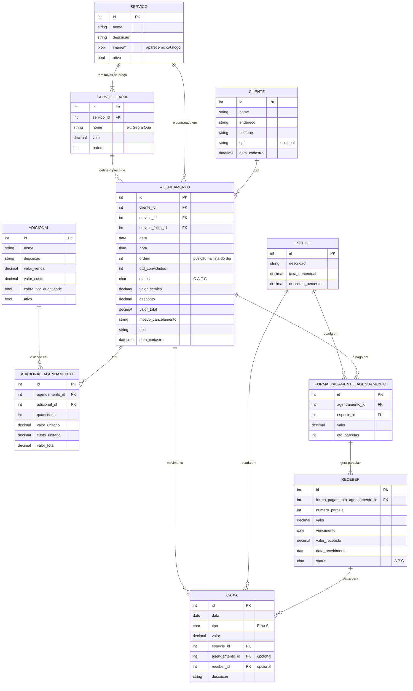
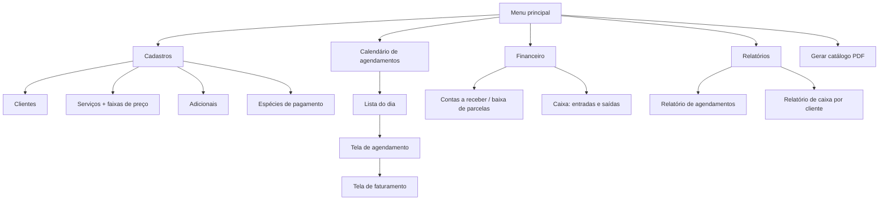
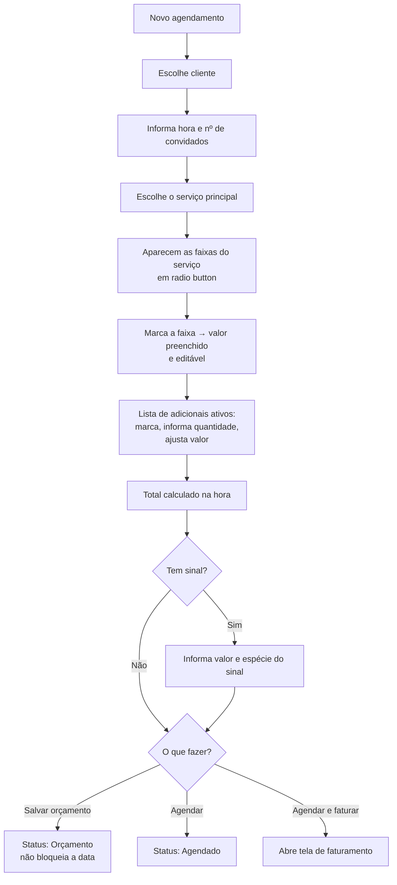
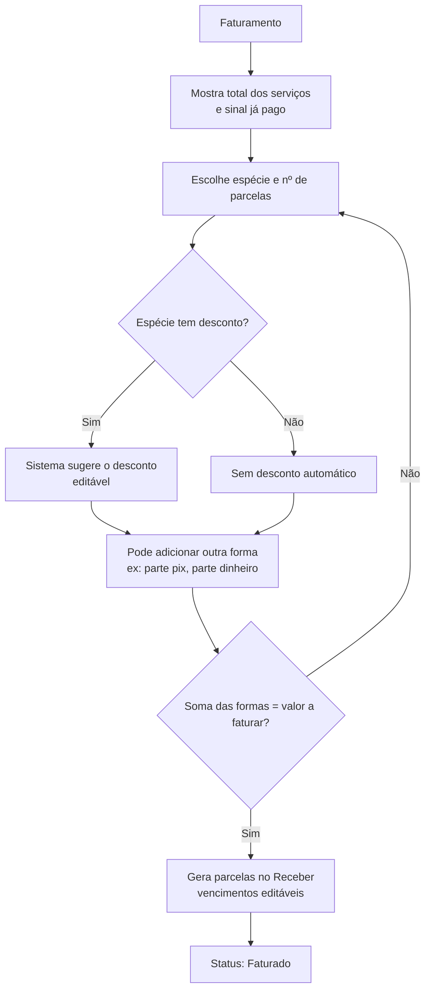
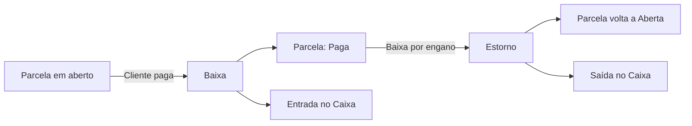
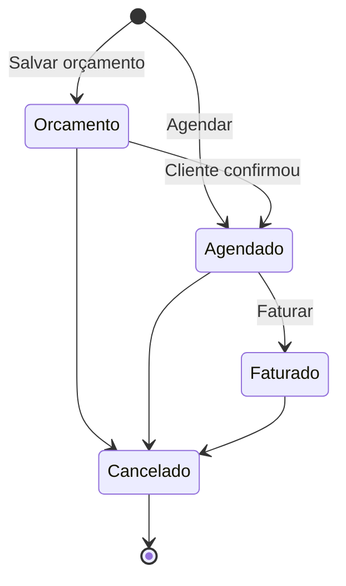

# Modelagem do Banco – Espaço de Festas

> Proposta para revisão do grupo. Comentem o que não fizer sentido.

## Visão geral

São **10 tabelas**, divididas em três grupos:

| Grupo | Tabelas |
|---|---|
| Cadastros | CLIENTE, SERVICO, SERVICO_FAIXA, ADICIONAL, ESPECIE |
| Agendamento | AGENDAMENTO, ADICIONAL_AGENDAMENTO |
| Financeiro | FORMA_PAGAMENTO_AGENDAMENTO, RECEBER, CAIXA |

## Diagrama ER



## Dicionário das tabelas

### Cadastros

**CLIENTE**: quem contrata o evento.
- `cpf` é opcional; se preenchido, deve ser único e válido.

**SERVICO**: o serviço principal (o espaço). Não guarda preço.
- `imagem` vai para o catálogo em PDF.

**SERVICO_FAIXA**: as faixas de preço de cada serviço, criadas livremente.
- Ex.: "Seg a Qua – R$ 800", "Qui e Sex – R$ 1.000", "Fim de semana/Feriado – R$ 1.500".
- Não há regra fixa de dia da semana nem de feriado: no agendamento, a faixa é escolhida num radio button.
- `ordem` define a ordem de exibição na tela e no catálogo.

**ADICIONAL**: garçom, comida, decoração, etc.
- `valor_venda` é o que se cobra do cliente; `valor_custo` é o que a empresa paga (ex.: o garçom).
- `cobra_por_quantidade`: se sim, total = quantidade × valor (garçom, comida por pessoa).

**ESPECIE**: formas de pagamento (dinheiro, pix, cartão…).
- `taxa_percentual`: taxa da maquininha, para saber o valor líquido.
- `desconto_percentual`: desconto sugerido (ex.: "à vista no dinheiro, 5%").

### Agendamento

**AGENDAMENTO**: o evento.
- `status`: **O** = orçamento, **A** = agendado, **F** = faturado, **C** = cancelado.
- `valor_servico`: vem da faixa escolhida, mas pode ser alterado.
- `valor_total` = valor_servico + soma dos adicionais − desconto.
- `ordem`: permite reordenar os agendamentos na lista do dia.

**ADICIONAL_AGENDAMENTO**: os adicionais contratados em cada agendamento.
- `valor_unitario` e `custo_unitario` são **copiados** do cadastro no momento do agendamento. Se o preço mudar depois, o agendamento antigo não muda.

### Financeiro

**FORMA_PAGAMENTO_AGENDAMENTO**: o que foi **combinado**.
- Ex.: R$ 500 no pix (1x) + R$ 1.200 no dinheiro (3x).
- A soma das formas tem de fechar com o `valor_total` do agendamento.

**RECEBER**: as **parcelas** geradas a partir de cada forma.
- `status`: **A** = aberto, **P** = pago, **C** = cancelado.

**CAIXA**: o que **entrou ou saiu de fato**.
- Entrada da baixa de parcela: `receber_id` e `agendamento_id` preenchidos.
- Saída do evento (pagar garçom, devolver sinal): só `agendamento_id`.
- Saída avulsa: nenhum dos dois.

## Regras de negócio que afetam o banco

1. **Valores congelados:** o agendamento guarda os valores praticados; mudar o cadastro não altera eventos já lançados.
2. **Nada é excluído se já foi usado:** clientes, serviços e adicionais usados em agendamento são inativados.
3. **Disponibilidade:** agendamentos não cancelados e não orçamento no mesmo dia não podem passar do máximo configurado.
4. **Orçamento não bloqueia a data** no calendário.
5. **Cancelamento:** parcelas em aberto viram canceladas; o que já entrou continua no caixa. Devolução de sinal = saída no CAIXA.
6. **Estorno de baixa:** reabre a parcela no RECEBER e lança uma saída no CAIXA. Nada é apagado.
7. **Valor pago e saldo não são gravados:** são calculados a partir do CAIXA e do RECEBER.

## Fora do banco (arquivo `appsettings.json`)

- Máximo de agendamentos por dia.
- Dados da empresa para o PDF: nome, telefone, endereço e caminho da logo.


# Fluxo do Sistema – Espaço de Festas

> Como o sistema vai funcionar, tela por tela. Proposta para revisão do grupo.

## Mapa das telas



## 1. Calendário (tela principal)

- Visão do mês, com cada dia colorido:
  - **livre**;
  - **com agendamento**;
  - **lotado** (atingiu o máximo do dia);
  - **orçamento** com outra cor, sem bloquear a data.
- Clique no dia → abre a **lista do dia**.

## 2. Lista do dia

- Agendamentos daquele dia: hora, cliente, status e valor.
- Setas para **subir e descer** a ordem dos agendamentos.
- Botões: **Novo**, **Abrir**, **Cancelar**.
- **Novo** fica desabilitado se o dia estiver lotado.

## 3. Tela de agendamento



**O que acontece com o sinal:** vira uma forma de pagamento de 1 parcela já paga e gera uma **entrada no caixa** na hora.

**Adicionais:**
- Garçom e comida (por pessoa) pedem quantidade.
- Decoração é valor fixo.
- O sistema também mostra o **custo** dos adicionais, para ver o lucro do evento.

## 4. Tela de faturamento

Pode ser aberta na hora do agendamento ou depois, a partir dele.



## 5. Recebimento (baixa de parcelas)



## 6. Status do agendamento



**No cancelamento:**
- Informa o motivo.
- Parcelas em aberto são canceladas.
- O que já foi pago continua no caixa. Se devolver o sinal, lança uma saída no caixa.

## 7. Cadastros

| Tela | O que tem |
|---|---|
| Clientes | nome, endereço, telefone, CPF (opcional) |
| Serviços | nome, descrição, imagem e uma grade de **faixas** (nome livre + valor + ordem) |
| Adicionais | nome, descrição, valor de venda, valor de custo, cobra por quantidade |
| Espécies | descrição, taxa (%), desconto (%) |

Nenhum cadastro já usado é excluído: ele é **inativado**.

## 8. Catálogo em PDF

- Puxa direto dos cadastros, então sai sempre com o preço atual.
- Cabeçalho com logo e dados da empresa.
- Formato:

```
SALÃO DE FESTAS                    [imagem]
  Seg a Qua ................ R$   800,00
  Qui e Sex ................ R$ 1.000,00
  Fim de semana/Feriado .... R$ 1.500,00

ADICIONAIS
  • Decoração simples ...... R$   400,00
  • Buffet (por pessoa) .... R$    45,00
  • Garçom (por unidade) ... R$   150,00
```

## 9. Relatórios

- **Agendamentos:** filtro por período e status; mostra cliente, serviço, total, pago e saldo.
- **Caixa por cliente:** entradas agrupadas por cliente, com total recebido e pendente.

## 10. Configurações (`appsettings.json`)

- Máximo de agendamentos por dia.
- Dados da empresa e logo para o PDF.