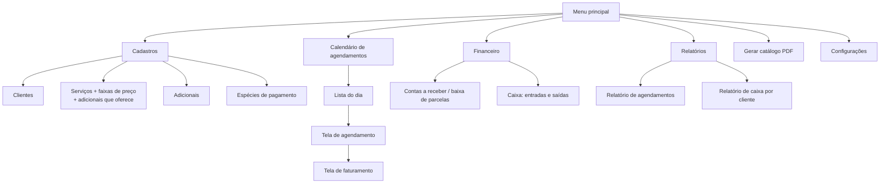
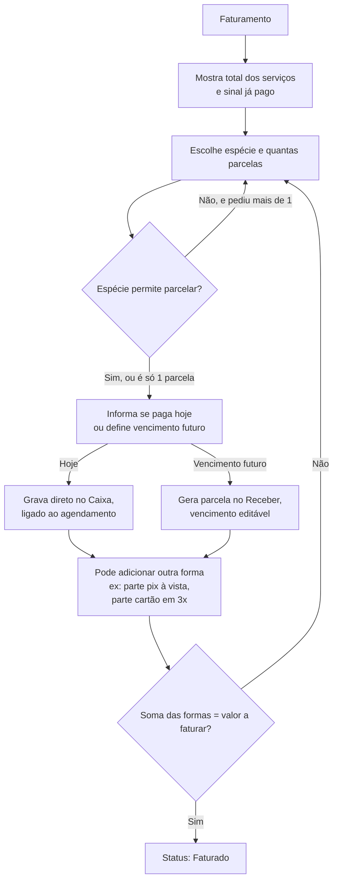
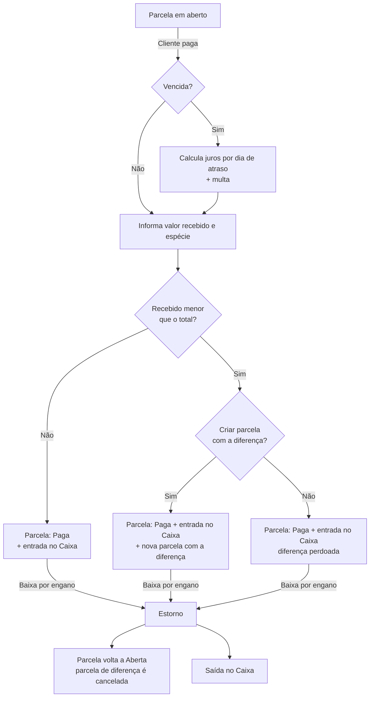
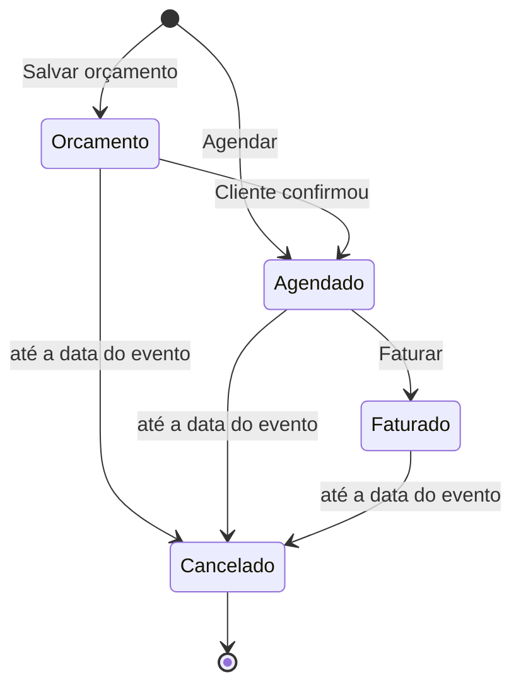

# Fluxo do Sistema – Espaço de Festas
 
> **Modelo fechado pelo grupo em 27/09/2026.** Acompanha o modelagem-banco.md.
> **Atualizado em 28/09/2026:** stack fechada (.NET 10, WPF, Entity Framework Core, Firebird 5, QuestPDF), requisitos numerados (RN, RF, RNF), configurações de negócio, juros/multa, baixa parcial e regras de cancelamento.
 
## Stack
 
| Item | Decisão |
|---|---|
| Plataforma | **.NET 10** (obrigatório), aplicação desktop |
| Interface | **WPF** (detalhes visuais a definir) |
| Banco | **Firebird 5** |
| Acesso ao banco | **Entity Framework Core** (`FirebirdSql.EntityFrameworkCore.Firebird`) |
| PDF | **QuestPDF** (conferir as condições da licença Community) |
| Versionamento | **Git** |
 
- Regras parametrizáveis são validadas na aplicação; o banco garante só a integridade estrutural.
- Nomes: banco em MAIÚSCULO_COM_UNDERSCORE por extenso; C# em PascalCase (classes e propriedades) e camelCase (variáveis). O EF faz o mapeamento (ver `modelagem-banco.md`).
## Mapa das telas
 

 
## 1. Calendário (tela principal)
 
- Visão do mês, com cada dia colorido:
  - **livre**;
  - **com agendamento**;
  - **orçamento com sinal** (bloqueia a data, se o bloqueio estiver ativo);
  - **orçamento sem sinal** com outra cor, sem bloquear a data.
- Clique no dia → abre a **lista do dia**.
## 2. Lista do dia
 
- Agendamentos e orçamentos daquele dia, por hora: cliente, serviço, status e valor.
- Botões: **Novo**, **Abrir**, **Cancelar**.
- Se a configuração **"um agendamento por dia"** estiver ativa, cada serviço só pode ter um agendamento por dia (Agendado, Faturado ou Orçamento com sinal). Serviço ocupado não aparece disponível no novo agendamento. O bloqueio é **por serviço**: salão e área externa podem estar na mesma data para clientes diferentes.
## 3. Tela de agendamento
 
```mermaid
flowchart TD
    A[Novo agendamento] --> B[Escolhe cliente]
    B --> C[Informa hora e nº de convidados]
    C --> D[Adiciona o serviço principal<br/>na grade de serviços]
    D --> E[Aparecem as faixas ativas<br/>do serviço em radio button]
    E --> F[Marca a faixa → valor preenchido<br/>e editável]
    F --> D2{Outro serviço?}
    D2 -- Sim --> D
    D2 -- Não --> G[Lista de adicionais vinculados<br/>ao(s) serviço(s) escolhidos:<br/>marca, informa quantidade,<br/>ajusta valor]
    G --> H[Total calculado na hora]
    H --> I{Tem sinal?}
    I -- Sim --> J[Informa valor e espécie do sinal<br/>→ grava direto no Financeiro]
    I -- Não --> K{O que fazer?}
    J --> K
    K -- Salvar orçamento --> L[Status: Orçamento<br/>com sinal bloqueia a data,<br/>sem sinal não bloqueia]
    K -- Agendar --> M[Status: Agendado]
    K -- Agendar e faturar --> N[Abre tela de faturamento]
```
 
**Serviços:** hoje, na prática, será um serviço por agendamento (o salão), mas a grade já permite mais de um (ex.: salão + área externa). Todo agendamento precisa de pelo menos um.
 
**Faixa:** ela escolhe a faixa que corresponde à data (dia de semana, fim de semana, feriado, promoção). O sistema não sugere nenhuma.
 
**Adicionais:**
- Só aparecem os adicionais **vinculados ao(s) serviço(s)** escolhidos (cadastro de Serviços define essa lista).
- Garçom e comida (por pessoa) pedem quantidade.
- Decoração é valor fixo.
- O sistema também mostra o **custo** dos adicionais, para ver o lucro do evento.
- Quando ela paga o garçom, lança uma **saída no caixa** ligada ao agendamento.
**O que acontece com o sinal:** é registrado **direto no caixa (Financeiro)**, ligado ao agendamento, na hora. Não gera parcela no Receber. Num orçamento, o sinal **garante a data** (quando o bloqueio está ativo).
 
**Converter orçamento em agendamento:** a disponibilidade é validada de novo, porque um orçamento sem sinal não reservou a data.
 
## 4. Tela de faturamento
 
Pode ser aberta na hora do agendamento ou depois, a partir dele.
 

 
**Desconto:** digitado manualmente, só até o faturamento.
 
**Depois de faturado, nada muda.** Itens, valores, desconto e formas de pagamento ficam travados. A única ação possível é cancelar.
 
## 5. Recebimento (baixa de parcelas)
 
Só existem parcelas no Receber quando algo ficou pendente (vencimento futuro). Pagamento feito na hora nunca passa por aqui.
 

 
**Juros e multa:**
```
juros por dia = valor da parcela × taxa mensal ÷ 30
juros         = juros por dia × dias de atraso
total         = parcela + multa + juros
```
Exemplo: parcela R$ 1.000,00, juros 2% a.m., multa 2%, 15 dias de atraso → juros R$ 10,00, multa R$ 20,00, total R$ 1.030,00. Mês comercial de 30 dias. Os valores aparecem preenchidos na tela de baixa.
 
**Estorno de pagamento à vista ou sinal:** como não há parcela, lança uma saída no caixa ligada ao agendamento.
 
## 6. Status do agendamento
 

 
**No cancelamento:**
- Só pode ser feito **no dia do evento ou antes**. Depois da data do evento, o botão Cancelar fica indisponível.
- O motivo é **obrigatório**: sem ele, o sistema não deixa cancelar. A data do cancelamento é gravada.
- Parcelas em aberto no Receber são canceladas e **não são cobradas**, dentro ou fora do prazo de devolução.
- Se o cancelamento for feito **até X dias antes do evento** (X definido nas configurações), tudo que foi pago — **sinal e parcelas** — é devolvido, com saída no caixa ligada ao agendamento.
- Depois desse prazo, não há devolução; o que foi pago continua no caixa.
## 7. Cadastros
 
| Tela | O que tem |
|---|---|
| Clientes | nome, endereço, cidade, UF, telefone, CPF (opcional), ativo |
| Serviços | nome, descrição, grade de **faixas** (nome livre, valor, ordem, ativo) e a lista de **adicionais que esse serviço oferece** |
| Adicionais | nome, descrição, valor de venda, valor de custo, cobra por quantidade, ativo |
| Espécies | descrição, se **permite parcelamento**, ativo |
 
Nenhum cadastro já usado é excluído: ele é **inativado**.
 
## 8. Configurações
 
Parâmetros de negócio, gravados no banco (tabela CONFIGURACAO) e alterados por esta tela:
 
| Configuração | O que faz |
|---|---|
| Um agendamento por dia | Liga/desliga o bloqueio de data por serviço |
| Juros ao mês (%) | Juros simples por atraso, cobrados por dia |
| Multa (%) | Multa por atraso sobre a parcela (padrão sugerido: 2%) |
| Prazo de cancelamento (dias) | Até quantos dias antes do evento há devolução |
 
## 9. Catálogo em PDF
 
- Gerado com QuestPDF, puxando direto dos cadastros, então sai sempre com o preço atual.
- Cabeçalho com logo e dados da empresa.
- Formato:
```
SALÃO DE FESTAS
  Seg a Qua ................ R$   800,00
  Qui e Sex ................ R$ 1.000,00
  Fim de semana/Feriado .... R$ 1.500,00
 
ADICIONAIS
  • Decoração simples ...... R$   400,00
  • Buffet (por pessoa) .... R$    45,00
  • Garçom (por unidade) ... R$   150,00
```
 
## 10. Relatórios
 
- **Agendamentos:** filtro por período e status; mostra cliente, serviço, total, pago e saldo.
- **Caixa por cliente:** entradas agrupadas por cliente, com total recebido e pendente.
## 11. Arquivo `config.ini`
 
Só configurações técnicas:
- Caminho / conexão do banco de dados.
- Dados da empresa e logo para o PDF.
---
 
## Requisitos
 
### Regras de Negócio (RN)
 
**Cadastros**
- **RN01** – O CPF do cliente é opcional; se informado, precisa ser válido e único.
- **RN02** – Nenhum cadastro já usado em agendamento é excluído (cliente, serviço, faixa, adicional, espécie); ele é inativado.
- **RN03** – Um serviço só aparece para agendar se tiver pelo menos uma faixa de preço ativa.
- **RN04** – Adicional que cobra por quantidade tem total = quantidade × valor unitário; os demais têm quantidade 1.
**Agendamento**
- **RN05** – Todo agendamento tem pelo menos um serviço.
- **RN06** – A faixa de preço é escolhida manualmente; o valor vem da faixa e pode ser editado.
- **RN07** – Só podem ser incluídos adicionais vinculados ao(s) serviço(s) escolhido(s).
- **RN08** – Valor de venda e custo dos itens são copiados no momento do lançamento; alterar o cadastro depois não muda agendamentos existentes.
- **RN09** – Valor total = serviços + adicionais − desconto.
- **RN10** – Disponibilidade configurável, **por serviço**. Com a opção "um agendamento por dia" ativa, o serviço fica bloqueado na data por agendamentos Agendados, Faturados ou Orçamentos com sinal pago. Com a opção desligada, não há bloqueio.
- **RN11** – Orçamento sem sinal não bloqueia a data; ao convertê-lo em Agendado, a disponibilidade é validada de novo.
- **RN12** – O sinal é gravado direto no caixa, ligado ao agendamento, e não gera parcela.
**Faturamento**
- **RN13** – O desconto é manual e só pode ser informado até o faturamento.
- **RN14** – A soma das formas de pagamento deve ser igual ao valor total menos os sinais já pagos.
- **RN15** – Espécie que não permite parcelamento aceita só 1 parcela.
- **RN16** – Pagamento no dia vai para o caixa; pagamento com vencimento futuro gera parcela no contas a receber.
- **RN17** – Agendamento faturado é imutável: itens, valores, desconto e formas de pagamento não podem mais ser alterados. A única ação possível é cancelar.
**Recebimento**
- **RN18** – Parcela vencida tem multa e juros simples ao mês, ambos configuráveis. Juros por dia = parcela × taxa mensal ÷ 30; total = parcela + multa + (juros por dia × dias de atraso). Os valores aparecem preenchidos na baixa.
- **RN19** – Na baixa com valor menor que o total, o sistema pergunta se deseja gerar nova parcela com a diferença. Se sim, cria a parcela com novo vencimento; se não, a diferença é perdoada. Em ambos os casos a parcela original fica paga.
- **RN20** – A espécie usada na baixa pode ser diferente da combinada na parcela.
- **RN21** – O estorno de baixa reabre a parcela e lança uma saída no caixa; se a baixa tinha gerado parcela de diferença, ela é cancelada junto.
**Cancelamento**
- **RN22** – O motivo é obrigatório, e a data do cancelamento é registrada.
- **RN23** – Parcelas em aberto são canceladas e não são cobradas, dentro ou fora do prazo de devolução.
- **RN24** – Se o cancelamento for feito até X dias antes do evento (X configurável), todos os valores pagos — sinal e parcelas — são devolvidos, com saída no caixa ligada ao agendamento. Depois do prazo, não há devolução.
- **RN25** – Nada é apagado; todo o histórico financeiro permanece.
- **RN27** – O cancelamento só pode ser feito até a data do evento, inclusive (data do cancelamento ≤ data do evento).
**Estorno**
- **RN26** – Estorno de pagamento à vista ou de sinal é uma saída no caixa ligada ao agendamento.
### Requisitos Funcionais (RF)
 
- **RF01** – Manter clientes.
- **RF02** – Manter serviços, com suas faixas de preço e os adicionais que cada um oferece.
- **RF03** – Manter adicionais (valor de venda, custo, cobrança por quantidade).
- **RF04** – Manter espécies de pagamento.
- **RF05** – Exibir calendário mensal com cores por situação (livre, agendado, orçamento com sinal, orçamento sem sinal).
- **RF06** – Listar os agendamentos e orçamentos do dia.
- **RF07** – Criar e editar orçamentos e agendamentos (até faturar).
- **RF08** – Registrar sinal.
- **RF09** – Converter orçamento em agendamento.
- **RF10** – Faturar agendamento com múltiplas formas de pagamento.
- **RF11** – Cancelar agendamento até a data do evento, com devolução conforme o prazo.
- **RF12** – Lançar despesas do evento (ex.: pagamento do garçom).
- **RF13** – Consultar contas a receber e dar baixa em parcelas, com juros, multa e baixa parcial.
- **RF14** – Estornar baixa de parcela e pagamento à vista/sinal.
- **RF15** – Consultar o caixa e fazer lançamentos avulsos.
- **RF16** – Mostrar o lucro do evento (receita − custos dos adicionais − despesas).
- **RF17** – Relatório de agendamentos por período e status.
- **RF18** – Relatório de caixa por cliente.
- **RF19** – Gerar catálogo em PDF com os preços atuais.
- **RF20** – Tela de configurações: bloqueio por dia, juros, multa e prazo de cancelamento.
### Requisitos Não Funcionais (RNF)
 
- **RNF01** – Aplicação desktop em .NET 10 com interface WPF.
- **RNF02** – Banco Firebird 5, acessado via Entity Framework Core.
- **RNF03** – Regras parametrizáveis validadas na aplicação; o banco garante só integridade estrutural (FKs, domínios, CHECKs fixos).
- **RNF04** – Banco autodocumentado: nomes por extenso no padrão do Firebird (MAIÚSCULO_COM_UNDERSCORE), domínios e `COMMENT ON` em todas as tabelas e campos. No C#, PascalCase para classes e propriedades.
- **RNF05** – Valores monetários em NUMERIC(18,2).
- **RNF06** – Exclusão lógica (inativação) em vez de física.
- **RNF07** – Conexão com o banco e dados da empresa no `config.ini`; parâmetros de negócio no banco.
- **RNF08** – Interface em português, com formatos brasileiros (dd/mm/aaaa, R$).
- **RNF09** – Monousuário, sem login na v1.
- **RNF10** – PDF gerado localmente com QuestPDF, sem depender de internet.
- **RNF11** – Código versionado em Git.
## Pontos em aberto
 
- [ ] Detalhes visuais da interface WPF.
- [ ] Conferir as condições da licença Community do QuestPDF.
## Fora do escopo agora (evoluções se ela contratar)
 
- Backup automático ou manual (decisão: sem backup por enquanto).
- Taxa da maquininha e desconto automático por espécie (hoje ela aplica o desconto manualmente).
- Feriados automáticos pela BrasilAPI.
- Envio do catálogo pelo WhatsApp / CRM.
- Login e permissões de usuário.
- Recibo de pagamento em PDF.
- Imagens dos serviços no catálogo.